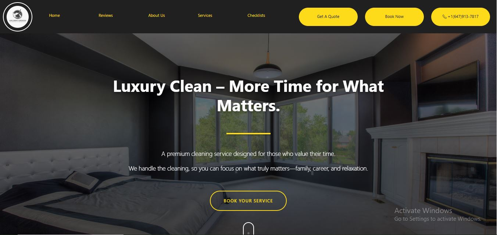
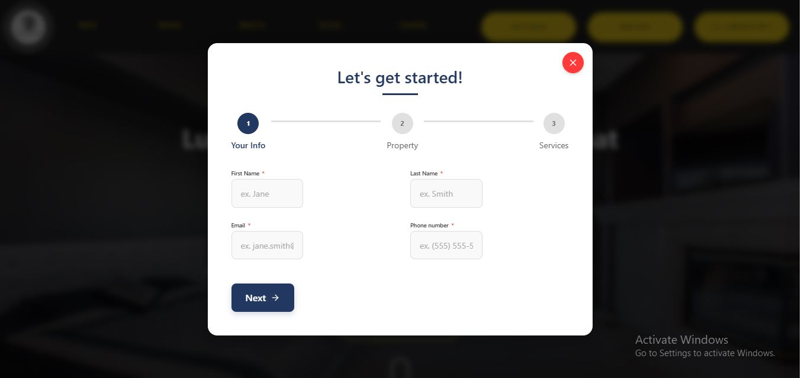
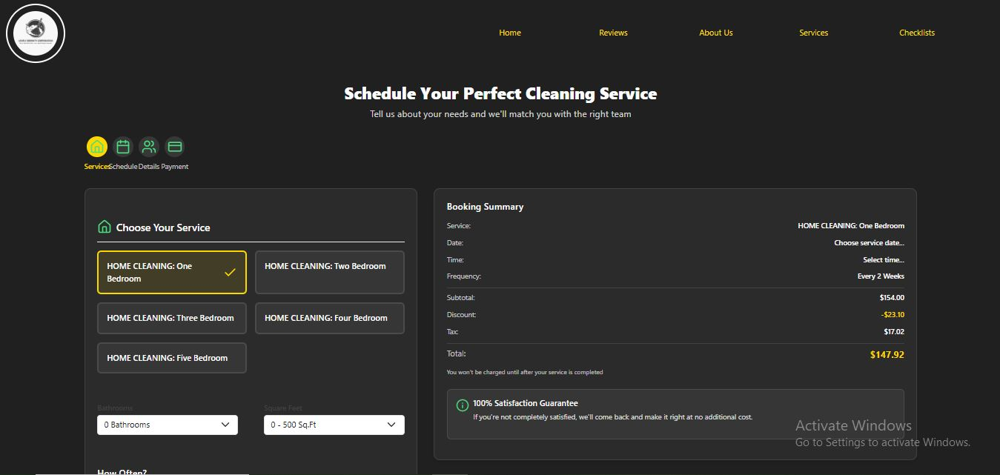

# Lovely Serenity Cleaning Services
<div align="center">
  <h3>Professional Cleaning Services Across Ontario, Canada</h3>
  <p>✨ Trusted • Reliable • Thorough ✨</p>
</div>

## 📋 Project Overview

This React-based website showcases Lovely Serenity Corp's premium cleaning services, allowing potential customers to explore service offerings, review detailed cleaning checklists, and conveniently book services online. The site features a responsive design with smooth navigation and interactive elements to deliver an exceptional user experience.

<div align="center">
  
</div>

## ✨ Key Features

- **📱 Responsive Design** - Optimized for all devices from mobile to desktop
- **🔄 Smooth Scrolling Navigation** - Effortless section-to-section navigation throughout the site
- **🧹 Service Showcase** - Comprehensive display of all cleaning service offerings
- **✓ Detailed Cleaning Checklists** - Transparent breakdown of what's included in each service type
- **📅 Online Booking System** - Integrated form for scheduling cleaning services
- **💰 Quote Request Form** - Pop-up form for customers to request custom quotes
- **⭐ Testimonials Section** - Showcase of client reviews and feedback

## 📸 Screenshots

<div align="center">
  
  <p><em>Our services</em></p>

  
  <p><em>Quote of our services</em></p>
  
  
  <p><em>Online Booking System</em></p>
  
</div>
## 🛠️ Technologies Used

<div align="center">

| Technology | Purpose |
|------------|---------|
| React.js | Frontend framework |
| React Router | Navigation management |
| JavaScript (ES6+) | Programming language |
| CSS3 | Styling |
| Bootstrap | Responsive design |
| React Hooks | State management |

</div>

## 🚀 Installation and Setup

1. **Clone the repository:**
   ```bash
   git clone https://github.com/DjaniNanda/Online-Booking-cleaning-Services.git
   ```

2. **Navigate to the project directory:**
   ```bash
   cd Online-Booking-cleaning-Service
   ```

3. **Set up the backend**
   ```bash
   cd backend
   pip install -r requirements.txt
   python manage.py migrate
   python manage.py runserver
   ```

4. **Set up the frontend**
   ```bash
   cd ../frontend
   npm install
   npm start
   ```

## 📞 Contact Information

For inquiries about our cleaning services:

- **Phone:** +1 (647) 913-7817
- **Email:** [contact@lovelyserenity.com](mailto:contact@lovelyserenity.com)
- **Website:** 

---

<div align="center">
  <p>© 2025 Lovely Serenity Corp. All Rights Reserved.</p>
</div>
 
